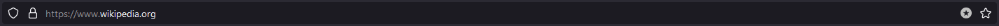
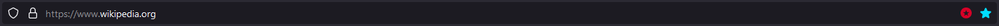
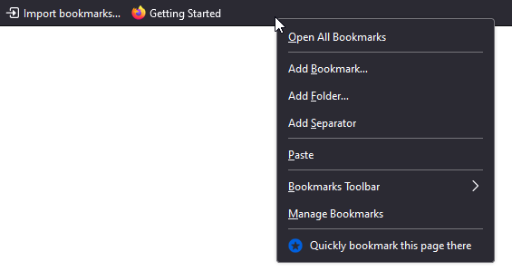

# Quick Bookmarking

**WebExtension allowing you to quickly bookmark pages to a default bookmark location via a dedicated icon. Some optional advanced features are also available.**

## Features

### Quick bookmark icon

Enabling this feature will add a quick bookmark icon in the address bar, to (un)bookmark a page with only one click.
The icon is a round star icon in the address bar.
If the current page is bookmarked, the icon will change color (configurable by the user among , red by default).

### Quick bookmark shortcut

Enabling this feature allow you to trigger the quick bookmarking via a dedicated shortcut (`Alt+Shift+D`).

### Quick bookmark context menu

You can enable this feature allowing you:
- Quickly bookmark the current page via the page context menu,
- when right-clicking on any bookmark folder to quickly bookmark the current page there.

### Settings

The following settings apply to the icon, shortcut and context menu (if enabled), unless specified otherwise.

- Select where the new bookmarks will be added:
  - User-defined folder.
  - Last used folder (by any bookmarking or sorting method).
  - Default folder used by Firefox.
- Choose to add the new bookmarks to the top or the bottom of the selected folder.
- Choose to show the page as bookmarked only if all the bookmarks of this page are in the folder you selected.
- Choose to not allow removal of bookmarks.

## Support

If you want to report a bug or help with translations, you can open an issue on [GitHub](https://github.com/teddy-gustiaux/quick-bookmarking/issues). If you do not have an account, you can create one for free.

## Changelog

Please refer to the <a href="https://github.com/teddy-gustiaux/quick-bookmarking/blob/master/CHANGELOG.md">full changelog</a> on GitHub.

## Attribution

*Third-party libraries:*
- [Bulma](https://bulma.io/)
- [Bulma Switch Extension](https://github.com/Wikiki/bulma-switch)

*Icons:*
- [Extension icon](https://www.flaticon.com/free-icon/bookmark_150854) made by [Smashicons](https://www.flaticon.com/authors/smashicons) from [Flaticon](https://www.flaticon.com) is licensed by [CC 3.0 BY](http://creativecommons.org/licenses/by/3.0/).
- [Extension/Bookmark icon](https://www.flaticon.com/free-icon/star-button_69468) made by [Bogdan Rosu](https://www.flaticon.com/authors/bogdan-rosu) from [Flaticon](https://www.flaticon.com) is licensed by [CC 3.0 BY](http://creativecommons.org/licenses/by/3.0/).
- [Cross icon](https://www.flaticon.com/free-icon/settings_128531) made by [Eleonor Wang](https://www.flaticon.com/authors/eleonor-wang) from [Flaticon](https://www.flaticon.com) is licensed by [CC 3.0 BY](http://creativecommons.org/licenses/by/3.0/).

## License

Distributed under the [MIT license](http://opensource.org/licenses/MIT).
